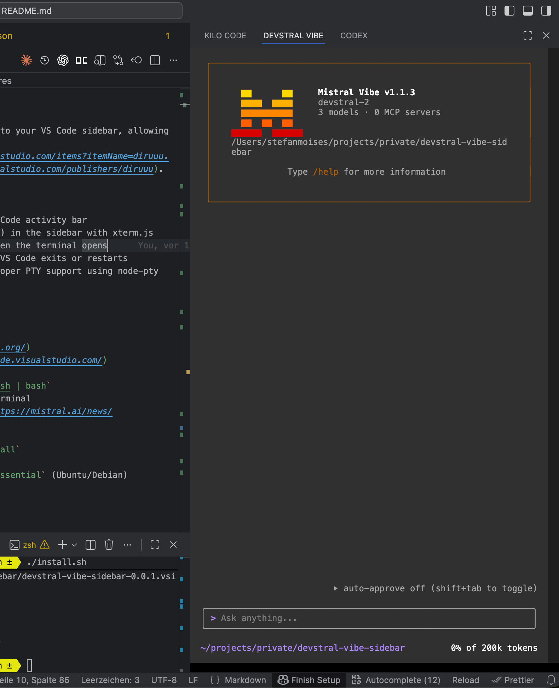

# Devstral Vibe Sidebar Extension for VS Code

This VS Code extension integrates Devstral Vibe CLI directly into your VS Code sidebar, allowing you to interact with Vibe without leaving your editor.
It is based on [Claude Code Sidebar](https://marketplace.visualstudio.com/items?itemName=diruuu.claude-code-sidebar) by [Rudi Wahyudi](https://marketplace.visualstudio.com/publishers/diruuu).

## Features

- **Sidebar Integration**: Adds a Devstral Vibe icon to the VS Code activity bar
- **VSCode Terminal**: Opens a standard VSCode shell terminal (zsh/bash/etc.) to the right of your current editor and loads the Vibe CLI.
- **Auto-start Vibe**: Automatically runs the `vibe` command when the terminal opens
- **Auto Cleanup**: Automatically closes the Vibe session when VS Code exits or restarts
- **Full Terminal Support**: Full terminal capabilities with proper PTY support using node-pty



## Prerequisites

Before installing this extension, make sure you have:

1. **VS Code** (v1.85.0 or higher) - [Download here](https://code.visualstudio.com/)
2. **Devstral Vibe CLI** installed and accessible in your PATH
   - Install with: `curl -LsSf https://mistral.ai/vibe/install.sh | bash`
   - You can verify this by running `vibe --version` in your terminal
   - For more information, see [Devstral Vibe documentation](https://mistral.ai/news/devstral-2-vibe-cli)

## Installation

### Step 1: Clone or Download the Repository

```bash
git clone https://github.com/proudcommerce/devstral-vibe-sidebar
cd devstral-vibe-sidebar
```

### Step 2: Install Dependencies

```bash
npm install
```

```bash
npm run rebuild
```

### Step 3: Compile the Extension

```bash
npm run compile
```

This will compile the TypeScript code to JavaScript in the `out` directory.

### Step 4: Install the Extension Locally

There are two ways to install the extension locally:

#### Option A: Using the Extension Development Host (Recommended for Testing)

1. Open the extension folder in VS Code:

   ```bash
   code .
   ```

2. Press `F5` or go to `Run > Start Debugging`

3. This will open a new VS Code window with the extension loaded

4. In the new window, you should see the Devstral Vibe icon in the activity bar (sidebar)

#### Option B: Package and Install (Recommended for Regular Use)

1. Install the `vsce` tool if you haven't already:

   ```bash
   npm install -g @vscode/vsce
   ```

2. Package the extension:

   ```bash
   vsce package
   ```

   This creates a `.vsix` file (e.g., `devstral-vibe-sidebar-0.0.2.vsix`)

3. Install the packaged extension:
   - Open VS Code
   - Go to Extensions view (`Ctrl+Shift+X` or `Cmd+Shift+X`)
   - Click the `...` menu at the top
   - Select `Install from VSIX...`
   - Choose the `.vsix` file you just created

4. Reload VS Code when prompted

## Usage

### Opening Devstral Vibe

1. Click the Devstral Vibe icon above your current editor window
2. A terminal will open in the sidebar (your default shell: zsh, bash, etc.)
3. The extension automatically runs `vibe` command for you
4. You can now interact with Devstral Vibe directly in the terminal

### Keyboard Shortcut

- **Windows/Linux**: `Ctrl+Alt+V`
- **macOS**: `Cmd+Alt+V`

### Interacting with Vibe

- Type directly in the terminal - it's a real terminal with full functionality
- Use all Vibe commands and features as you normally would
- Use slash commands for configuration adjustments
- The terminal supports all standard terminal operations (copy, paste, keyboard shortcuts, etc.)

### Closing Devstral Vibe

The terminal and Vibe session will automatically close when:

- You close VS Code
- You reload VS Code window (`Ctrl+R` or `Cmd+R`)
- The extension is deactivated

You can also manually exit Vibe by typing `exit` or pressing `Ctrl+D`, then close the sidebar panel.

## Troubleshooting

### Extension doesn't appear in the sidebar

- Make sure the extension is installed correctly
- Try reloading VS Code (`Ctrl+R` or `Cmd+R`)
- Check the Output panel (`View > Output`) and select "Devstral Vibe Sidebar" for error messages

### "vibe is not found" or similar error

- Ensure the `vibe` command is in your system PATH
- Try running `vibe --version` in your regular terminal
- If it doesn't work, reinstall Vibe CLI: `curl -LsSf https://mistral.ai/vibe/install.sh | bash`


### Terminal shows errors or doesn't respond

- Check if Vibe CLI is working correctly outside VS Code
- Look at the VS Code Developer Console (`Help > Toggle Developer Tools`) for error messages
- Make sure you have the latest version of Vibe installed

### Vibe process doesn't close properly

- The extension tries to clean up automatically, but if you notice lingering processes:
  - Check running processes: `ps aux | grep vibe`
  - Manually kill if needed: `kill <process-id>`

## Configuration

The extension supports the following settings:

| Setting | Default | Description |
|---------|---------|-------------|
| `devstralVibeSidebar.command` | `vibe` | The command to run in the terminal |
| `devstralVibeSidebar.additionalArgs` | `` | Additional arguments to pass to the Vibe command |

## Development

### Project Structure

```
sidebar-devstral-vibe-vscode-extension/
├── src/
│   └── extension.ts          # Main extension code
├── resources/
│   └── devstral-logo.svg     # Extension icon
├── out/                       # Compiled JavaScript (generated)
├── package.json               # Extension manifest
├── tsconfig.json             # TypeScript configuration
└── README.md                 # This file
```

### Making Changes

1. Edit the TypeScript files in `src/`
2. Compile: `npm run compile`
3. Test using `F5` (Extension Development Host)
4. Package and install for production use

### Watch Mode

For active development, you can use watch mode to automatically recompile on changes:

```bash
npm run watch
```

## How It Works

The extension:

1. Creates a webview in the VS Code sidebar
2. Launches a new VSCode terminal in the webview
3. Automatically sends the `vibe` command to the terminal after it starts
4. Provides full terminal functionality with proper input/output handling

## About Devstral Vibe

Devstral Vibe is an open-source command-line coding assistant powered by Devstral from Mistral AI. It allows you to explore, modify, and execute changes across your codebase using natural language.

Key features:

- **Project Awareness**: Automatically scans file structure and Git status
- **Smart References**: Reference files with `@`, execute shell commands with `!`
- **Multi-file Orchestration**: Understands entire codebases for architecture-level reasoning
- **Persistence**: Persistent history, autocompletion, and customizable themes

For more information, visit [Mistral AI](https://mistral.ai/news/devstral-2-vibe-cli).

## License

MIT

## Contributing

Contributions are welcome! Please feel free to submit issues or pull requests.

## Support

If you encounter any issues or have questions:

1. Check the Troubleshooting section above
2. Open an issue on GitHub
3. Check the Devstral Vibe documentation

## Changelog

### 0.0.2 (VSCode Terminal)

- switch from custom sidebar terminal implementation to a more robust and lightweight VSCode terminal integration

### 0.0.1 (Initial Release)

- Sidebar integration with Devstral Vibe icon
- Real terminal using xterm.js and node-pty
- Auto-start Vibe command on terminal launch
- Full PTY support with proper terminal emulation
- Auto cleanup on VS Code exit/restart
- Terminal resize support
- Configurable command and arguments
